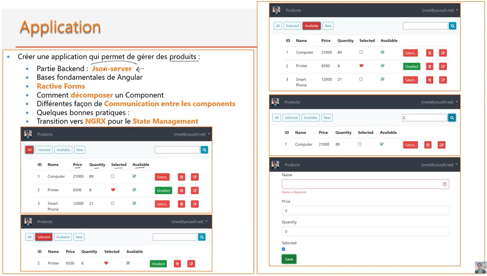
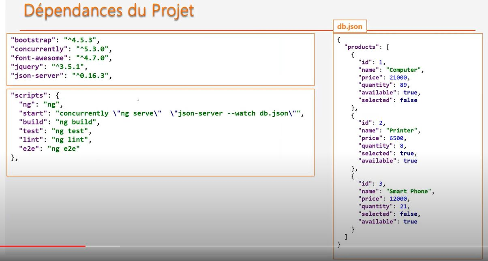
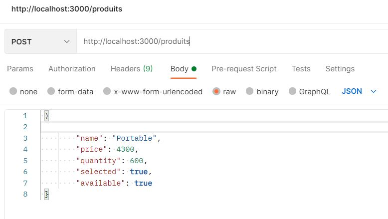
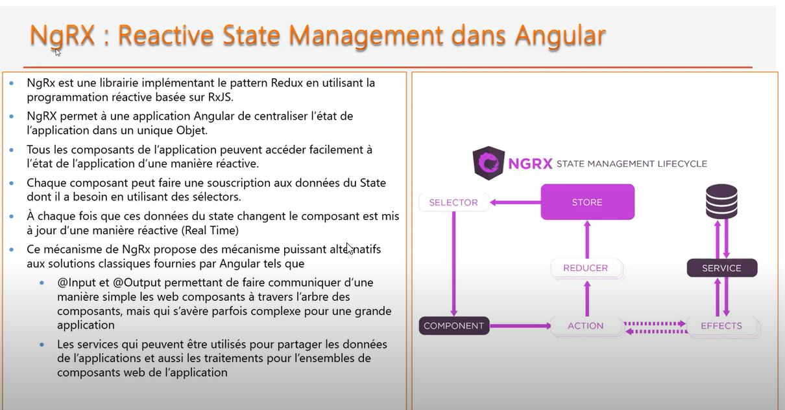
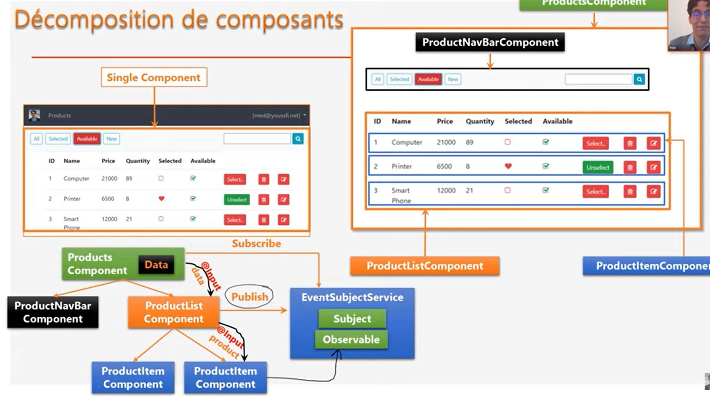

# Application V3 utlisant le framework angular 11  ( projet avec décomposition de composants et utlisation de NGRX )

**Input** : signifie pour un composant donné de rececoir des données d'un autres composants

**Outup** : Signifie qu'un composant emet un evenement vers le composant qui l'instancie ( ou lui fait appel dans sa page html)

 
 
 #### Avantage et inconvenient de Input et Output
**Avantage:** decompositions de l'application par composants au lieu d'un unique compoant

**Inconvenient:**  La decomposition de l'application en composants plus petits induit des appels en cascade pour remonté tous la branche jusqu'à l'appel de la fonction principale.


https://ultimatecourses.com/blog/angular-ngfor-async-pipe

Emettre un evenement sur sa sortie. Exemple select, delete , edit ....  dans le composant **Products-List.Component.ts**

````angular2
  @Output() productEventEmitterListProduct: EventEmitter<ActionEvent> = new EventEmitter();
````
Recevoir des données sur son entrée dans le composant **Products-List.Component.ts**. pour exemple listProductsInput va lui etre affecté la liste des produit dans le composant principal **Products.Component.ts**, qu'il devra ensuite affiché. 

````angular2
  @Input() public listProductsInput$: Observable<AppDataState<Product[]>> | null = null;
````

dans le composant principal **Products.Component.html**

````angular2
<app-products-list  [listProductsInput$]="products$"  (productEventEmitterListProduct)="onActionEventProductsList($event)"></app-products-list>
````

**[listProductsInput$]=products$**:  fait reférence à **Input**

**(productEventEmitterListProduct)=onActionEventProductsList($event)**: fait réfénrece à **Output**


## Application angular 11




## Angular version
````angular2
C:\PERSONNEL\tools\cmder
λ ng --version

     _                      _                 ____ _     ___
    / \   _ __   __ _ _   _| | __ _ _ __     / ___| |   |_ _|
   / △ \ | '_ \ / _` | | | | |/ _` | '__|   | |   | |    | |
  / ___ \| | | | (_| | |_| | | (_| | |      | |___| |___ | |
 /_/   \_\_| |_|\__, |\__,_|_|\__,_|_|       \____|_____|___|
                |___/


Angular CLI: 11.2.6
Node: 14.16.0
OS: win32 x64

Angular:
...
Ivy Workspace:

Package                      Version
------------------------------------------------------
@angular-devkit/architect    0.1102.6 (cli-only)
@angular-devkit/core         11.2.6 (cli-only)
@angular-devkit/schematics   11.2.6 (cli-only)
@schematics/angular          11.2.6 (cli-only)
@schematics/update           0.1102.6 (cli-only)

````

## Creation d'un projet angular

````shell script
C:\PERSONNEL\eclipse-workspace-java-training\Dveloppement-Web-Front-End-Angular-11 (main -> origin)
λ ng new web-catalog-application-angular11
? Do you want to enforce stricter type checking and stricter bundle budgets in the workspace?
  This setting helps improve maintainability and catch bugs ahead of time.
  For more information, see https://angular.io/strict Yes
? Would you like to add Angular routing? Yes
? Which stylesheet format would you like to use? CSS
CREATE web-catalog-application-angular11/angular.json (3839 bytes)
CREATE web-catalog-application-angular11/package.json (1223 bytes)
````


## Dependances


###  json-server dependance

Get a full fake REST API with zero coding in less than 30 seconds (seriously)
Created with <3 for front-end developers who need a quick back-end for prototyping and mocking. https://github.com/typicode/json-server

nous utlisons le fichier db.json

installation 
se position sur le projet puis installé la dependance


````shell script
λ npm install -save json-server
λ npm install -save bootstrap
λ npm install --save jquery
λ npm install --save font-awesome
λ npm install --save popper.js
````


### Concurrently dependance

````shell script
λ npm install --save  concurrently
````

modifier le fichier **package.json** comme suit.

````shell script
{
  "name": "web-catalog-application-angular11",
  "version": "0.0.0",
  "scripts": {
    "ng": "ng",
    #"start": "ng serve ",
    "start": "concurrently \"ng serve\" \"json-server --watch db.json\"",
    "build": "ng build",
    "test": "ng test",
    "lint": "ng lint",
    "e2e": "ng e2e"
  }
....


## Demarrage du json-server fake


````shell script
> concurrently "ng serve" "json-server --watch db.json"

[1]
[1]   \{^_^}/ hi!
[1]
[1]   Loading db.json
[1]   Done
[1]
[1]   Resources
[1]   http://localhost:3000/produits
[1]
[1]   Home
[1]   http://localhost:3000
[1]
[1]   Type s + enter at any time to create a snapshot of the database
[1]   Watching...
[1]
````

- pour acceder à la base de donné fake utiliser l'url suivante  **http://localhost:3000/produits**

````json
GET http://localhost:3000/produits
[
{
id: 1,
name: "Computer",
price: 4300,
quantity: 600,
selected: true,
available: true
},
{
id: 2,
name: "Printer",
price: 300,
quantity: 100,
selected: true,
available: true
},
{
id: 3,
name: "Smartphone",
price: 1200,
quantity: 100,
selected: true,
available: true
}
]
````

````json
GET http://localhost:3000/produits/1
{
id: 1,
name: "Computer",
price: 4300,
quantity: 600,
selected: true,
available: true
}
````

Post



- pour acceder à l'application utiliser l'url suivante **http://localhost:4200**

## Changer le style et les scripts angular 
Modifier le fichier angular.json comme suit

````json
            "styles": [
              "src/styles.css",
              "./node_modules/bootstrap/dist/css/bootstrap.min.css"
            ],
            "scripts": [
              "./node_modules/jquery/dist/jquery.min.js",
              "./node_modules/popper.js/dist/umd/popper.min.js",
              "./node_modules/bootstrap/dist/js/bootstrap.min.js"
            ]
          }
````


## Composants angular


````shell script
λ ng g c components/products/products-nav-bar
CREATE src/app/components/products/products-nav-bar/products-nav-bar.component.html (31 bytes)
CREATE src/app/components/products/products-nav-bar/products-nav-bar.component.spec.ts (684 bytes)
CREATE src/app/components/products/products-nav-bar/products-nav-bar.component.ts (313 bytes)
CREATE src/app/components/products/products-nav-bar/products-nav-bar.component.css (0 bytes)
UPDATE src/app/app.module.ts (1256 bytes)

λ ng g c components/products/products-list
CREATE src/app/components/products/products-list/products-list.component.html (28 bytes)
CREATE src/app/components/products/products-list/products-list.component.spec.ts (669 bytes)
CREATE src/app/components/products/products-list/products-list.component.ts (302 bytes)
CREATE src/app/components/products/products-list/products-list.component.css (0 bytes)
UPDATE src/app/app.module.ts (1385 bytes)

----------------------------------------------------

 ng g c components/nav-bar
CREATE src/app/components/nav-bar/nav-bar.component.html (22 bytes)
CREATE src/app/components/nav-bar/nav-bar.component.spec.ts (627 bytes)
CREATE src/app/components/nav-bar/nav-bar.component.ts (278 bytes)
CREATE src/app/components/nav-bar/nav-bar.component.css (0 bytes)

https://www.w3schools.com/bootstrap4/bootstrap_navbar.asp

ng g c components/products
CREATE src/app/components/products/products.component.html (23 bytes)
CREATE src/app/components/products/products.component.spec.ts (640 bytes)
CREATE src/app/components/products/products.component.ts (283 bytes)
CREATE src/app/components/products/products.component.css (0 bytes)
UPDATE src/app/app.module.ts (589 bytes)

ng g c components/home
CREATE src/app/components/home/home.component.html (19 bytes)
CREATE src/app/components/home/home.component.spec.ts (612 bytes)
CREATE src/app/components/home/home.component.ts (267 bytes)
CREATE src/app/components/home/home.component.css (0 bytes)
UPDATE src/app/app.module.ts (674 bytes)

formulaire ( formBuilder) de saisie pour ajouter un nouveau produit
λ ng g c components/add-product
CREATE src/app/components/add-product/add-product.component.html (26 bytes)
CREATE src/app/components/add-product/add-product.component.spec.ts (655 bytes)
CREATE src/app/components/add-product/add-product.component.ts (294 bytes)
CREATE src/app/components/add-product/add-product.component.css (0 bytes)
UPDATE src/app/app.module.ts (967 bytes)


formulaire ( formBuilder) edition de produit
λ ng g c components/edit-product
CREATE src/app/components/edit-product/edit-product.component.html (27 bytes)
CREATE src/app/components/edit-product/edit-product.component.spec.ts (662 bytes)
CREATE src/app/components/edit-product/edit-product.component.ts (298 bytes)
CREATE src/app/components/edit-product/edit-product.component.css (0 bytes)
UPDATE src/app/app.module.ts (1084 bytes)
````


## Services angular
````shell script
ng g s services/products
CREATE src/app/services/products.service.spec.ts (367 bytes)
CREATE src/app/services/products.service.ts (137 bytes)
````

## Create classes Model
````shell script
ng generate interface  models/product --type=model
CREATE src/app/models/product.model.ts (30 bytes)
````

## Subscribe

Il existe deux methodes pour recuperer des données depuis une api de façon asynchrone

### Methode 1

  ````angular2
  public products: Product[] | null = null;
  ../..
  this.productsservice.getAllProducts().subscribe(data => {this.products = data; }, error => {console.log(error); });
````

````html
<div class="container" *ngIf="products">
  <table class="table">
    <tr>
      <th>ID</th><th>Name</th><th>Price</th><th>Quantity</th><th>Selected</th><th>Availabble</th>
    </tr>
    <tr *ngFor="let p of products">
       <td>{{p.id}}</td>
      <td>{{p.name}}</td>
      <td>{{p.price}}</td>
      <td>{{p.quantity}}</td>
      <td>{{p.selected}}</td>
      <td>{{p.available}}</td>
    </tr>
  </table>
</div>
````

### Methode 2

declaration d'une variable **Observable** , il faut au niveau du code html introduire la directive **async**
````angular2html
  public products$: Observable<Product[]> | null = null ;
  ..//..
  this.products$ = this.productsservice.getAllProducts();

````

````html
<div class="container" *ngIf="products$">
  <table class="table">
    <tr>
      <th>ID</th><th>Name</th><th>Price</th><th>Quantity</th><th>Selected</th><th>Availabble</th>
    </tr>
    <tr *ngFor="let p of products$ | async">
       <td>{{p.id}}</td>
      <td>{{p.name}}</td>
      <td>{{p.price}}</td>
      <td>{{p.quantity}}</td>
      <td>{{p.selected}}</td>
      <td>{{p.available}}</td>
    </tr>
  </table>
</div>
````


## Demarrage du projet

````shell script
λ npm start
````


## recupération de l'id de l'url

il faut faire appelle à la calsse ActivatedRoute.snpashot.params.id
    this.productId = activatedRoute.snapshot.params.id;

## Etat de l'application: methode input output d'angular.


## Etat de l'application: methode ngRx. ( préféré). projet v3  ( subscriber et publisher )

le défaut de la méthode **input output** d'Angular deviens assez compliquer pour de grosse application. Il faut donc préféré **ngRx** à la place qui s'appuye sur **EventSubjectService**



